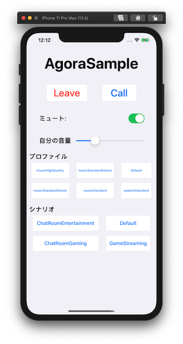

# AgoraSample
A sample app using `Agora Voice SDK` for iOS.



## Setup 
Need to install `AgoraRtcEngine_iOS` with `cocoapods`. Please run tha following command.
- `pod install`

## Note
- `Require iOS 13 (possible to down. Please change DEPLOYMENT_TARGET if you need.)`
- `Require Developer Account (Not Personal)`
- `Do not work on Simulator`
- `Need to get AgoraAppId from Console` (https://console.agora.io/)

```swift
class ViewController: UIViewController {    
    // please change AppId to valid one.
    lazy var engine = AgoraRtcEngineKit.sharedEngine(withAppId: "AGORA_APP_ID", delegate: self)
}
```